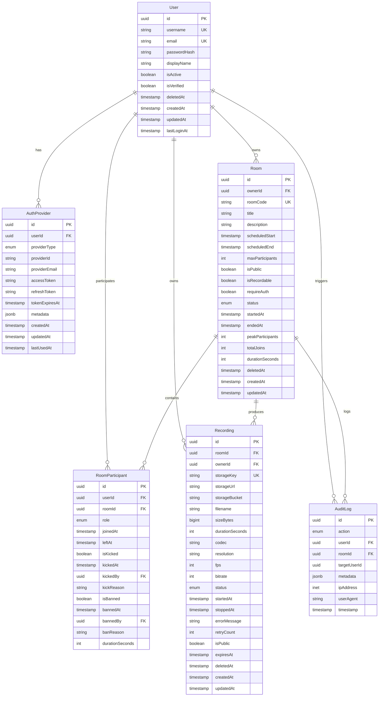

# Database Schema Visualization

## Entity Relationship Diagram



## Enums

### AuthProviderType
```
LOCAL       → Username/password authentication
GOOGLE      → OAuth 2.0 via Google
GITHUB      → OAuth 2.0 via GitHub
MICROSOFT   → OAuth 2.0 via Microsoft
APPLE       → OAuth 2.0 via Apple
SAML        → Enterprise SSO (future)
```

### RoomStatus
```
CREATED     → Room created, waiting for first participant
LIVE        → Meeting in progress
ENDED       → Meeting concluded normally
CANCELLED   → Scheduled meeting cancelled
```

### ParticipantRole
```
HOST        → Full control (owner)
CO_HOST     → Elevated permissions (moderator)
PARTICIPANT → Basic permissions (attendee)
```

### RecordingStatus
```
STARTED     → Recording initiated
IN_PROGRESS → Actively recording
STOPPED     → Recording stopped
FAILED      → Recording failed
PROCESSING  → Post-processing (transcoding)
READY       → Available for playback
```

### AuditAction (31 total)
```
Authentication:
  USER_REGISTERED, USER_LOGIN_SUCCESS, USER_LOGIN_FAILED, USER_LOGOUT

Room Lifecycle:
  ROOM_CREATED, ROOM_STARTED, ROOM_ENDED, ROOM_CANCELLED

Participant Actions:
  USER_JOINED, USER_LEFT, USER_KICKED, USER_BANNED

Permissions:
  ROLE_CHANGED, ROLE_PROMOTION, ROLE_DEMOTION

Media Control:
  USER_MUTED, USER_UNMUTED, ALL_MUTED, 
  SCREEN_SHARE_STARTED, SCREEN_SHARE_STOPPED

Recording:
  RECORDING_STARTED, RECORDING_STOPPED, RECORDING_DELETED

WebRTC:
  PRODUCER_CREATED, PRODUCER_CLOSED, 
  CONSUMER_CREATED, CONSUMER_CLOSED

Security:
  UNAUTHORIZED_ACCESS_ATTEMPT, RATE_LIMIT_EXCEEDED, SUSPICIOUS_ACTIVITY
```

## Relationship Cardinality

| Relationship | Cardinality | Notes |
|--------------|-------------|-------|
| User → AuthProvider | 1:N | One user, multiple OAuth providers |
| User → Room (owner) | 1:N | One user owns many rooms |
| User ↔ Room (participant) | M:N | Many users, many rooms (via RoomParticipant) |
| Room → RoomParticipant | 1:N | One room, many participation records |
| Room → Recording | 1:N | One room, multiple recordings (stop/restart) |
| User → Recording (owner) | 1:N | One user starts multiple recordings |
| User → AuditLog | 1:N | One user generates many audit events |
| Room → AuditLog | 1:N | One room generates many audit events |

## Deletion Strategy

| Model | Deletion Type | Reason |
|-------|---------------|--------|
| User | Soft Delete | Preserve audit trail, GDPR compliance |
| Room | Soft Delete | Preserve meeting history |
| Recording | Soft Delete | Retention policy, GDPR compliance |
| AuthProvider | Cascade Delete | No value in orphaned OAuth tokens |
| RoomParticipant | Cascade Delete | Participation is room metadata |
| AuditLog | **NEVER DELETE** | Immutable security trail |

## Index Strategy

### High-Traffic Queries

```sql
-- Active users
SELECT * FROM users WHERE is_active = true AND deleted_at IS NULL;
-- Index: users[is_active, deleted_at]

-- Active rooms
SELECT * FROM rooms WHERE status = 'LIVE' AND deleted_at IS NULL;
-- Index: rooms[status, deleted_at]

-- Room participants
SELECT * FROM room_participants WHERE room_id = ? AND left_at IS NULL;
-- Index: room_participants[room_id, left_at]

-- User's active rooms
SELECT * FROM room_participants WHERE user_id = ? AND left_at IS NULL;
-- Index: room_participants[user_id, left_at]

-- Audit trail (time-series)
SELECT * FROM audit_logs WHERE room_id = ? ORDER BY timestamp DESC LIMIT 100;
-- Index: audit_logs[room_id, timestamp DESC]

-- Ban enforcement
SELECT * FROM room_participants WHERE room_id = ? AND user_id = ? AND is_banned = true;
-- Index: room_participants[is_banned, room_id]

-- Expired recordings cleanup
SELECT * FROM recordings WHERE expires_at < NOW() AND deleted_at IS NULL;
-- Index: recordings[expires_at, deleted_at]
```

## Data Flow

### User Registration Flow
```
1. Create User record
2. Create AuthProvider (LOCAL type)
3. Create AuditLog (USER_REGISTERED)
```

### Create & Join Room Flow
```
1. Create Room record (status = CREATED)
2. Create AuditLog (ROOM_CREATED)
3. User joins → Create RoomParticipant (role = HOST)
4. Create AuditLog (USER_JOINED)
5. Update Room (status = LIVE, startedAt = now)
6. Create AuditLog (ROOM_STARTED)
```

### Recording Flow
```
1. Host starts recording
2. Create Recording (status = STARTED)
3. Create AuditLog (RECORDING_STARTED)
4. Update Recording (status = IN_PROGRESS)
5. Host stops recording
6. Update Recording (status = STOPPED, stoppedAt = now, sizeBytes, durationSeconds)
7. Create AuditLog (RECORDING_STOPPED)
8. Background job: Update Recording (status = PROCESSING)
9. Background job: Update Recording (status = READY, storageUrl)
```

### Soft Delete User Flow
```
1. Update User (deletedAt = now, email = null, displayName = 'Deleted User')
2. Update Room (status = ENDED) for all owned live rooms
3. Update RoomParticipant (leftAt = now) for all active participations
4. Update Recording (deletedAt = now) for all owned recordings
5. Create AuditLog (USER_LOGOUT, reason = 'account_deleted')
6. AuditLog records remain (userId preserved but user is anonymized)
```

## Schema Evolution Examples

### Adding New Feature: User Bio

```prisma
model User {
  // ... existing fields
  bio String? @db.Text // ✅ Optional (no breaking change)
}
```

Migration:
```bash
npx prisma migrate dev --name add_user_bio
```

### Adding New Enum Value: BANNED to RoomStatus

```prisma
enum RoomStatus {
  CREATED
  LIVE
  ENDED
  CANCELLED
  BANNED      // ✅ New value
}
```

Migration:
```sql
-- Prisma generates
ALTER TYPE "room_status" ADD VALUE 'BANNED';
```

### Adding New Relation: Room Categories

```prisma
model RoomCategory {
  id        String @id @default(uuid()) @db.Uuid
  name      String @db.VarChar(100)
  rooms     Room[]
  createdAt DateTime @default(now())
}

model Room {
  // ... existing fields
  categoryId String?       @db.Uuid
  category   RoomCategory? @relation(fields: [categoryId], references: [id])
  
  @@index([categoryId])
}
```

Migration:
```bash
npx prisma migrate dev --name add_room_categories
```

## Performance Benchmarks (Expected)

Based on PostgreSQL best practices with proper indexing:

| Query | Rows | Expected Latency | Index Used |
|-------|------|------------------|------------|
| Find user by email | 1 | < 1ms | users[email] |
| Active room participants | 100 | < 5ms | room_participants[room_id, left_at] |
| User's active rooms | 10 | < 5ms | room_participants[user_id, left_at] |
| Audit trail (paginated) | 100 | < 10ms | audit_logs[room_id, timestamp DESC] |
| Recording cleanup | 1000 | < 50ms | recordings[expires_at] |
| Room statistics | 1 + 1000 | < 20ms | Multiple covering indexes |

**At scale** (10M users, 100M meetings, 1B audit logs):
- Use table partitioning for `audit_logs` (by month)
- Use read replicas for analytics queries
- Use PgBouncer for connection pooling (1000+ connections)
- Consider sharding `room_participants` by `room_id` (if single DB bottleneck)

---

**Note**: This visualization represents the logical schema. See `schema.prisma` for the complete implementation with all constraints, defaults, and indexes.
